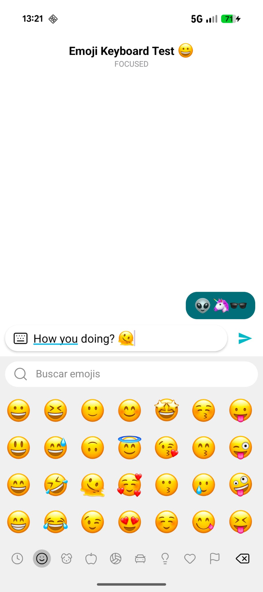

# Emoji Keyboard

Customizable and easy-to-use emoji keyboard library for Android.

## Features

- Displays as a popup that coexists with the system keyboard
- Highly customizable: provide your own emoji set, font and style or use the defaults
- Automatic management of recently used emojis
- Fast and efficient search emojis by keywords
- EmojiEditText and EmojiTextView components to display emojis with selected font

<div align="center">
  
  
</div>

## Requirements

- **minSdk**: 24 (Android 7.0)
- **targetSdk**: 36 (Android 16.0)
- **Kotlin**: 1.9+
- **Java**: 17+

## Installation & Quick Start

1. Add the dependency to your `build.gradle.kts`:

```kotlin
implementation("me.imbox:emojikeyboard:0.1.0")
```

2. Initialize the emoji provider and configuration in Application class:

```kotlin
EmojiManager.install(
  context = this,
  config = EmojiConfig(
    layoutMode = EmojiLayoutMode.COOPER  // default
  )
)
```

3. Create an `EmojiPopup` in the Activity or Fragment you want to use it:
```kotlin
emojiPopup = EmojiPopup(activity = this)  // for Activity
emojiPopup = EmojiPopup(activity = requireActivity())  // for Fragment
emojiPopup = EmojiPopup(rootView = decorView)  // custom (proper function not guaranteed!)
```

4. Setup the `EmojiPopup` basic functionality:
```kotlin
emojiPopup.bindTo(editText = myEditText)  // set a field to write emojis on
myButton.setOnClickListener { emojiPopup.toggle() }  // change between ime and emojis
```

5. (Optional but recommended) Setup the advanced functionality:
```kotlin
emojiPopup.setOnPopupStateChangedListener { state ->
  // react to state changes
}

onBackPressedDispatcher.addCallback(this, object : OnBackPressedCallback(true) {
  override fun handleOnBackPressed() {
      if (emojiPopup.state == PopupState.FOCUSED) {
          // capture back press to hide the popup instead of navigating back
          emojiPoupup.hide()
      }
  }
})
```

## License

Copyright 2026 - IMBox Technologies and contributors

Licensed under the Apache License, Version 2.0

## Acknowledgements

This project is heavily inspired by Vanniktech's [Emoji](https://github.com/vanniktech/Emoji). Thanks for that amazing library!
While it shares design ideas and concepts, this is an independent implementation.
